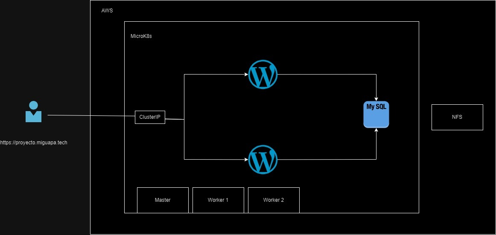

# Proyecto 2
---

### **Curso:** ST0263 - Tópicos Especiales en Telemática
### **Título:** Proyecto 2 - Cluster en kubernetes.
### **Objetivo:**

El objetivo es desplegar una aplicación en un clúster Kubernetes de alta disponibilidad utilizando la distribución MicroK8s en una infraestructura como servicio (IaaS) proporcionada por AWS.

### **Estudiantes:**
- Miguel Ángel Calvache Giraldo
- Mauricio David Correa Hernandez
- Miguel Angel Martinez Garcia
- Salomon Velez Perez
- Simon Botero

### Profesor: Edwin Montoya - emontoya@eafit.edu.co

## 1. Descripción general de la actividad
---

Este proyecto consiste en la implementación un CMS a traves de un cluster de kubernetes creados con microk8s, con un minimo de 3 maquinas virtuales funcionando. Tambien se tiene, aparte de esto, un servidor NFS, y una base de datos de alta disponibilidad. El CMS incluye su propio dominio y certificado SSL.

---

### 1.1 Aspectos cumplidos

- **Cluster de kubernetes con microk8s.**
- **Un master y 5 workers.**
  - Master - Para Cluster mcirok8s.
  - Slave 1 - Para WordPress.
  - Slave 2 - Para WordPress.
  - NFS - Para servidor NFS.
  - MySQL2 - Para MySQL. (Se puede obviar)
  - MySQL3 - Para MySQL. (Se puede obviar).
- **Servidor NFS para almacenar los datos.**
- **Dominio propio (proyecto2.miguapa.tech).**
- **Configuración del certificado SSL.**
- **WordPress 2 pods.**
- **MySQL 1 pod.**

---

### 1.2 Aspectos no desarrollados

- A pesar de que se tiene una base de datos mysql, esta no dispone de alta disponibilidad.
- A pesar de que no se logró la base de datos en alta disponibilidad, se hicieron varios intentos. En la sección de ```03.MySQL/03.2.MySQL-Con-HA```, se puede encontrar las configuraciones que se hicieron.

## 2. Arquitectura del sistema
---

 

## 3. Descripción del ambiente de desarrollo
---
El cluster se configuró con microk8s, y se uso la nube de AWS para las instancias.

Para este proyecto, se crearon 6 instancias, un master, dos workers, un servidos NFS, dos instncias más para MySQL, para hacer hacer la configuración de MySQL para alta disponibilidad.

---

### 3.1. EC2 en AWS

En AWS se configuraron las 6 instancias de la siguiente manera.

#### Instancias.


#### IPs Elásticas.


#### Nombre de instancias y AMI.


#### Tipo de instancia y Llave de ingreso.


#### Configuración de red y Almacenamiento.


#### Grupo de seguridad.


---

### 3.2. Configuración de las instancias

Para la configuracion de las instancias se ejecutaron los siguientes comandos.

Ver los comandos en la sección 01.Comandos.

- [01.Comandos-master](01.Comandos/01.Comandos-master.md)
- [02.Comandos-slave1](01.Comandos/02.Comandos-slave1.md)
- [03.Comandos-slave2](01.Comandos/03.Comandos-slave2.md)
- [04.Comandos-nfs](01.Comandos/04.Comandos-nfs.md)
- [05.Comandos-mysql-2](01.Comandos/05.Comandos-mysql-2.md)
- [06.Comandos-mysql-3](01.Comandos/06.Comandos-mysql-3.md)

---

### 3.3. Instalar Microk8s.

Sigue los siguientes pasos.

[1. Instalar snap si es necesario.](https://snapcraft.io/docs/installing-snap-on-debian)

[2. Instalar microk8s.](https://microk8s.io/)

En la sección de 'Turn on the services you want', adicionar los siguinetes comandos.
``` bash
sudo usermod -a -G microk8s ubuntu
sudo mkdir ~/.kube
sudo chown -R ubuntu ~/.kube
microk8s enable dashboard
microk8s enable dns
microk8s enable registry
microk8s enable community
microk8s enable istio
microk8s enable ingress
```

[3. Crear el cluster.](https://microk8s.io/docs/clustering)

Para adicionar un nodo, en la instancia del master.

```bash
microk8s add-node
```
Que devolverá lo lo siguiente.
```bash
From the node you wish to join to this cluster, run the following:
microk8s join 192.168.1.230:25000/92b2db237428470dc4fcfc4ebbd9dc81/2c0cb3284b05

Use the '--worker' flag to join a node as a worker not running the control plane, eg:
microk8s join 192.168.1.230:25000/92b2db237428470dc4fcfc4ebbd9dc81/2c0cb3284b05 --worker

If the node you are adding is not reachable through the default interface you can use one of the following:
microk8s join 192.168.1.230:25000/92b2db237428470dc4fcfc4ebbd9dc81/2c0cb3284b05
microk8s join 10.23.209.1:25000/92b2db237428470dc4fcfc4ebbd9dc81/2c0cb3284b05
microk8s join 172.17.0.1:25000/92b2db237428470dc4fcfc4ebbd9dc81/2c0cb3284b05
```

Para adicionar un nodo como worker, en la instancia del worker.

```bash
microk8s join 192.168.1.230:25000/92b2db237428470dc4fcfc4ebbd9dc81/2c0cb3284b05 --worker
```

_**Este proceso se debe hacer tantos nodos sea necesario adicionar al cluster.**_

[4. Para el NFS.](https://microk8s.io/docs/how-to-nfs)

---

### 3.4 Manifestos

- **Creamos las siguientes carpetas donde queramos tener toda la información.**

- **Creamos los archivos necesarios también.**

```bash
mkdir NFS-manifests  k8s-wordpress
cd NFS-manifests/
touch pvc-nfs.yaml  sc-nfs.yaml
cd ../k8s-wordpress/
mkdir ingress  mysql  ssl  wordpress
cd ingress/
touch http-ingress.yaml
cd ../mysql/
touch mysql-deployment.yaml  mysql-pv.yaml  mysql-pvc.yaml  mysql-service.yaml
cd ../ssl/
mkdir yamls
cd yamls/
touch cluster-issuer-staging.yaml  cluster-issuer.yaml  ingress-routes.yaml
cd ../../wordpress/
touch wp-deployment.yaml  wp-pv.yaml  wp-pvc.yaml  wp-service.yaml
```
---

### 3.4.1. Manifiestos para el NFS

**StorageClass.**

```docker
# sc-nfs.yaml
---
apiVersion: storage.k8s.io/v1
kind: StorageClass
metadata:
  name: nfs-csi
provisioner: nfs.csi.k8s.io
parameters:
  server: 172.31.29.85
  share: /srv/nfs
reclaimPolicy: Delete
volumeBindingMode: Immediate
mountOptions:
  - hard
  - nfsvers=4.1
```


**PVC.**

```docker
# pvc-nfs.yaml
---
apiVersion: v1
kind: PersistentVolumeClaim
metadata:
  name: my-pvc
spec:
  storageClassName: nfs-csi
  accessModes: [ReadWriteOnce]
  resources:
    requests:
      storage: 5Gi
```
---

### 3.4.2. Manifiestos para el MYSQL
**3.4.2.1. SIN ALTA DISPONIBILIDAD.**

**PV.**

```docker
# mysql-pv.yaml
---
apiVersion: v1
kind: PersistentVolume
metadata:
  name: mysql-pv
spec:
  capacity:
    storage: 5Gi
  volumeMode: Filesystem
  accessModes:
    - ReadWriteMany
  persistentVolumeReclaimPolicy: Retain
  storageClassName: nfs-csi
  nfs:
    server: 172.31.29.85  # Dirección IP de tu servidor NFS
    path: /srv/nfs        # Ruta del directorio compartido NFS
```

**PVC.**

```docker
# mysql-pvc.yaml
---
apiVersion: v1
kind: PersistentVolumeClaim
metadata:
  name: mysql-pvc
  labels:
    app: mysql
spec:
  accessModes:
    - ReadWriteMany
  storageClassName: nfs-csi
  resources:
    requests:
      storage: 2Gi
```

**SERVICIO.**

```docker
# mysql-service.yaml
---
apiVersion: v1
kind: Service
metadata:
  name: mysql
  labels:
    app: wordpress
spec:
  ports:
    - port: 3306
  selector:
    app: wordpress
    tier: mysql
  clusterIP: None
```

**DEPLOYMENT.**

```docker
# mysql-deployment.yaml
---
apiVersion: apps/v1
kind: Deployment
metadata:
  name: wordpress-mysql
  labels:
    app: wordpress
spec:
  selector:
    matchLabels:
      app: wordpress
      tier: mysql
  strategy:
    type: Recreate
  template:
    metadata:
      labels:
        app: wordpress
        tier: mysql
    spec:
      containers:
      - name: mysql
        image: docker.io/bitnami/mysql:8.0
        env:
        - name: MYSQL_ROOT_PASSWORD
          value: contraseña_mysql
        - name: MYSQL_DATABASE
          value: proyecto2
        - name: MYSQL_USER
          value: mauriciodch
        - name: MYSQL_PASSWORD
          value: mauriciodch123
        ports:
        - containerPort: 3306
          name: mysql
        volumeMounts:
        - name: mysql-persistent-storage
          mountPath: /var/lib/mysql
      volumes:
      - name: mysql-persistent-storage
        persistentVolumeClaim:
          claimName: mysql-pvc
```
**Aplicamos los manifiestos.**

```bash
microk8s kubectl apply -f mysql-pv.yaml
microk8s kubectl apply -f mysql-pvc.yaml
microk8s kubectl apply -f mysql-service.yaml
microk8s kubectl apply -f mysql-deployment.yaml
```

**3.4.2.2. CON ALTA DISPONIBILIDAD.**

**HASTA DONDE SE LOGRÓ FUE LO SIGUIENTE.**

El problema que se presenta es que el usuario para la base de datos no tiene permisos. (Eso es lo que toca solucionar).

**CONFIGMAP.**
```docker
# mysql-configmap.yaml
---
apiVersion: v1
kind: ConfigMap
metadata:
  name: mysql
  labels:
    app: mysql
    app.kubernetes.io/name: mysql
data:
  primary.cnf: |
    # Apply this config only on the primary.
    [mysqld]
    log-bin
  replica.cnf: |
    # Apply this config only on replicas.
    [mysqld]
    super-read-only

  init.sql: |
    # Archivo para inicializar la base de datos en el contenedor primario.
    CREATE USER 'mauriciodch'@'%' IDENTIFIED BY 'mauriciodch123';
    GRANT ALL PRIVILEGES ON *.* TO 'mauriciodch'@'%' WITH GRANT OPTION;
    FLUSH PRIVILEGES;
    # Crear la base de datos proyecto2
    CREATE DATABASE proyecto2;
```

**SERVICES.**

Se utiliza el patrón CQRS.

**Patrón CQRS.**


**Dos servicios.**
- La primera es para la escritura.
- La segunda es para la lectura.

```docker
# mysql-services.yaml
---
# Headless service for stable DNS entries of StatefulSet members.
apiVersion: v1
kind: Service
metadata:
  name: mysql
  labels:
    app: mysql
    app.kubernetes.io/name: mysql
spec:
  ports:
  - name: mysql
    port: 3306
  clusterIP: None
  selector:
    app: mysql
---
# Client service for connecting to any MySQL instance for reads.
# For writes, you must instead connect to the primary: mysql-0.mysql.
apiVersion: v1
kind: Service
metadata:
  name: mysql-read
  labels:
    app: mysql
    app.kubernetes.io/name: mysql
    readonly: "true"
spec:
  ports:
  - name: mysql
    port: 3306
  selector:
    app: mysql
```

**STATEFULSET.**
```docker
# mysql-statefulset.yaml
---
apiVersion: apps/v1
kind: StatefulSet
metadata:
  name: mysql
spec:
  selector:
    matchLabels:
      app: mysql
      app.kubernetes.io/name: mysql
  serviceName: mysql
  replicas: 3
  template:
    metadata:
      labels:
        app: mysql
        app.kubernetes.io/name: mysql
    spec:
      initContainers:
      - name: init-mysql
        image: mysql:5.7
        command:
        - bash
        - "-c"
        - |
          set -ex
          # Generate mysql server-id from pod ordinal index.
          [[ $HOSTNAME =~ -([0-9]+)$ ]] || exit 1
          ordinal=${BASH_REMATCH[1]}
          echo [mysqld] > /mnt/conf.d/server-id.cnf
          # Add an offset to avoid reserved server-id=0 value.
          echo server-id=$((100 + $ordinal)) >> /mnt/conf.d/server-id.cnf
          # Copy appropriate conf.d files from config-map to emptyDir.
          if [[ $ordinal -eq 0 ]]; then
            cp /mnt/config-map/primary.cnf /mnt/conf.d/
          else
            cp /mnt/config-map/replica.cnf /mnt/conf.d/
          fi
        volumeMounts:
        - name: conf
          mountPath: /mnt/conf.d
        - name: config-map
          mountPath: /mnt/config-map
      - name: clone-mysql
        image: gcr.io/google-samples/xtrabackup:1.0
        command:
        - bash
        - "-c"
        - |
          set -ex
          # Skip the clone if data already exists.
          [[ -d /var/lib/mysql/mysql ]] && exit 0
          # Skip the clone on primary (ordinal index 0).
          [[ `hostname` =~ -([0-9]+)$ ]] || exit 1
          ordinal=${BASH_REMATCH[1]}
          [[ $ordinal -eq 0 ]] && exit 0
          # Clone data from previous peer.
          ncat --recv-only mysql-$(($ordinal-1)).mysql 3307 | xbstream -x -C /var/lib/mysql
          # Prepare the backup.
          xtrabackup --prepare --target-dir=/var/lib/mysql
        volumeMounts:
        - name: data
          mountPath: /var/lib/mysql
          subPath: mysql
        - name: conf
          mountPath: /etc/mysql/conf.d
      containers:
      - name: mysql
        image: mysql:5.7
        env:
        - name: MYSQL_ALLOW_EMPTY_PASSWORD
          value: "1"
        - name: MYSQL_USER
          value: "mauriciodch"  # Define el nombre de usuario
        - name: MYSQL_PASSWORD
          value: "mauriciodch123"  # Define la contraseña del usuario
        - name: MYSQL_DATABASE
          value: proyecto2
        ports:
        - name: mysql
          containerPort: 3306
        volumeMounts:
        - name: data
          mountPath: /var/lib/mysql
          subPath: mysql
        - name: conf
          mountPath: /mnt/conf.d
        - name: config-map
          mountPath: /mnt/config-map
        - name: mysql-init
          mountPath: /docker-entrypoint-initdb.d/init.sql  # Se asegura que el script de inicialización se ejecute
          subPath: init.sql
        resources:
          requests:
            cpu: 500m
            memory: 1Gi
        livenessProbe:
          exec:
            command: ["mysqladmin", "ping"]
          initialDelaySeconds: 30
          periodSeconds: 10
          timeoutSeconds: 5
        readinessProbe:
          exec:
            command: ["mysql", "-h", "127.0.0.1", "-e", "SELECT 1"]
          initialDelaySeconds: 5
          periodSeconds: 2
          timeoutSeconds: 1
      - name: xtrabackup
        image: gcr.io/google-samples/xtrabackup:1.0
        ports:
        - name: xtrabackup
          containerPort: 3307
        command:
        - bash
        - "-c"
        - |
          set -ex
          cd /var/lib/mysql

          # Determine binlog position of cloned data, if any.
          if [[ -f xtrabackup_slave_info && "x$(<xtrabackup_slave_info)" != "x" ]]; then
            cat xtrabackup_slave_info | sed -E 's/;$//g' > change_master_to.sql.in
            rm -f xtrabackup_slave_info xtrabackup_binlog_info
          elif [[ -f xtrabackup_binlog_info ]]; then
            [[ `cat xtrabackup_binlog_info` =~ ^(.*?)[[:space:]]+(.*?)$ ]] || exit 1
            rm -f xtrabackup_binlog_info xtrabackup_slave_info
            echo "CHANGE MASTER TO MASTER_LOG_FILE='${BASH_REMATCH[1]}',\
                  MASTER_LOG_POS=${BASH_REMATCH[2]}" > change_master_to.sql.in
          fi

          if [[ -f change_master_to.sql.in ]]; then
            echo "Waiting for mysqld to be ready (accepting connections)"
            until mysql -h 127.0.0.1 -e "SELECT 1"; do sleep 1; done

            echo "Initializing replication from clone position"
            mysql -h 127.0.0.1 \
                  -e "$(<change_master_to.sql.in), \
                          MASTER_HOST='mysql-0.mysql', \
                          MASTER_USER='root', \
                          MASTER_PASSWORD='', \
                          MASTER_CONNECT_RETRY=10; \
                        START SLAVE;" || exit 1
            mv change_master_to.sql.in change_master_to.sql.orig
          fi

          exec ncat --listen --keep-open --send-only --max-conns=1 3307 -c \
            "xtrabackup --backup --slave-info --stream=xbstream --host=127.0.0.1 --user=root"
        volumeMounts:
        - name: data
          mountPath: /var/lib/mysql
          subPath: mysql
        - name: conf
          mountPath: /etc/mysql/conf.d
        resources:
          requests:
            cpu: 100m
            memory: 100Mi
      volumes:
      - name: conf
        emptyDir: {}
      - name: config-map
        configMap:
          name: mysql
      - name: mysql-init
        configMap:
          name: mysql
          items:
          - key: init.sql
            path: init.sql
  volumeClaimTemplates:
  - metadata:
      name: data
    spec:
      accessModes: ["ReadWriteOnce"]
      resources:
        requests:
          storage: 10Gi
      storageClassName: nfs-csi  # Especifica el StorageClass NFS
```
**Aplicamos los manifiestos.**

```bash
microk8s kubectl apply -f mysql-configmap.yaml
microk8s kubectl apply -f mysql-services.yaml
microk8s kubectl apply -f mysql-statefulset.yaml
```

En otra terminal ejecutamos este comando par ver el proceso de creación de los pods y todo el proceso del cluster.

```bash
microk8s kubectl get pods -l app=mysql --watch
```

Después de un rato, se verá esto así.

```bash
microk8s kubectl get pods -l app=mysql
---
NAME      READY     STATUS    RESTARTS   AGE
mysql-0   2/2       Running   0          2m
mysql-1   2/2       Running   0          1m
mysql-2   2/2       Running   0          1m
```

---

### 3.4.2. Manifiestos para el WORDPRESS.

**PV.**
```docker
# wordpress-pv.yaml
---
apiVersion: v1
kind: PersistentVolume
metadata:
  name: wordpress-pv
spec:
  capacity:
    storage: 5Gi
  accessModes:
    - ReadWriteMany
  persistentVolumeReclaimPolicy: Retain
  storageClassName: nfs-csi  # Debe coincidir con tu StorageClass disponible
  nfs:
    path: /srv/nfs  # Asegúrate de que esta ruta sea correcta
    server: 172.31.29.85  # Cambia esto por la IP de tu servidor NFS
```

**PVC.**

```docker
# wordpress-pvc.yaml
---
apiVersion: v1
kind: PersistentVolumeClaim
metadata:
  name: wordpress-pvc
spec:
  accessModes:
    - ReadWriteMany
  resources:
    requests:
      storage: 5Gi
  storageClassName: nfs-csi  # Debe coincidir con tu StorageClass disponible
```

**SERVICIO.**
```docker
# wordpress-service.yaml
---
apiVersion: v1
kind: Service
metadata:
  labels:
    app: wordpress
  name: wordpress
spec:
  type: ClusterIP
  ports:
    - port: 80
      targetPort: 80
      protocol: TCP
      name: http
    - port: 443
      targetPort: 443
      protocol: TCP
      name: https
  selector:
    app: wordpress
```

**DEPLOYMENT.**
```docker
# wordpress-deployment.yaml
---
apiVersion: apps/v1
kind: Deployment
metadata:
  name: wordpress
  labels:
    app: wordpress
spec:
  replicas: 2
  selector:
    matchLabels:
      app: wordpress
      tier: frontend
  strategy:
    type: Recreate
  template:
    metadata:
      labels:
        app: wordpress
        tier: frontend
    spec:
      containers:
      - image: wordpress
        name: wordpress
        env:
        - name: WORDPRESS_DATABASE_HOST
          value: mysql
        - name: WORDPRESS_DATABASE_PASSWORD
          value: mauriciodch123
        - name: WORDPRESS_DATABASE_USER
          value: mauriciodch
        - name: WORDPRESS_DATABASE_NAME
          value: proyecto2
        - name: WORDPRESS_DEBUG
          value: "1"
        ports:
        - containerPort: 80
          name: wordpress
        volumeMounts:
        - name: wordpress-persistent-storage
          mountPath: /var/www/html
      volumes:
      - name: wordpress-persistent-storage
        persistentVolumeClaim:
          claimName: wordpress-pvc
```
**Aplicamos los manifiestos.**

```bash
microk8s kubectl apply -f wordpress-pv.yaml
microk8s kubectl apply -f wordpress-pvc.yaml
microk8s kubectl apply -f wordpress-service.yaml
microk8s kubectl apply -f wordpress-deployment.yaml
```

---
### 3.4.3. Manifiestos para el INGRESS.

**HTTP INGRESS**
```docker
# http-ingress.yaml
---
apiVersion: networking.k8s.io/v1
kind: Ingress
metadata:
  name: http-ingress
  labels:
    app: wordpress
spec:
  rules:
  - http:
      paths:
      - pathType: Prefix
        path: "/"
        backend:
          service:
            name: wordpress
            port:
              number: 80
```
**Aplicamos el manifiesto.**

```bash
microk8s kubectl apply -f http-ingress.yaml
```
---
### 3.4.3. Manifiestos para el CERTIFICADO SSL.

- Agregar el registro de la IP pública de la máquina MASTER en nuestro servidor DNS, con el fin de que pueda resolver el dominio y mappearlo al MASTER de manera correcta.

- Ejecutar los siguiente comandos.

```bash
microk8s kubectl apply -f https://github.com/cert-manager/cert-manager/releases/download/v1.8.0/cert-manager.crds.yaml

microk8s kubectl create namespace cert-manager

microk8s kubectl apply -f https://github.com/cert-manager/cert-manager/releases/download/v1.8.0/cert-manager.yaml

# Validamos la creación exitosa de 3 pods con microk8s kubectl get pods -n=cert-manager

# Validamos los logs microk8s kubectl logs -n cert-manager -l app=cert-manager

# Creamos 2 claves para los archivos cluster-issuer-staging.yaml y cluster-issuer.yaml con:

cd ssl

openssl genrsa -out letsencrypt-staging.pem 2048
openssl genrsa -out letsencrypt-private-key.pem 2048

# Creamos los secretos:
sudo microk8s kubectl create secret generic letsencrypt-staging --from-file=letsencrypt-staging.pem
microk8s kubectl create secret generic letsencrypt-private-key --from-file=letsencrypt-private-key.pem

# Luego ingresamos a los archivos que están en.
cd yamls
```
**Manifiestos para SSL.**

**1. CLUSTER ISSUER STAGING.**
```docker
# cluster-issuer-staging.yaml
---
apiVersion: cert-manager.io/v1
kind: ClusterIssuer
metadata:
  name: letsencrypt-staging
spec:
  acme:
    email: macalvach@eafit.edu.co
    server: https://acme-staging-v02.api.letsencrypt.org/directory
    privateKeySecretRef:
      name: letsencrypt-staging
    solvers:
    - http01:
        ingress:
          class: public
```
**2. CLUSTER ISSUER.**

```docker
# cluster-issuer.yaml
---
apiVersion: cert-manager.io/v1
kind: ClusterIssuer
metadata:
  name: letsencrypt-prod
spec:
  acme:
    # The ACME server URL
    server: https://acme-v02.api.letsencrypt.org/directory
    # Email address used for ACME registration
    email: macalvach@eafit.edu.co
    # Name of a secret used to store the ACME account private key
    privateKeySecretRef:
      name: letsencrypt-private-key
    # Enable the HTTP-01 challenge provider
    solvers:
      - http01:
          ingress:
            class: public
```

**3. INGRESS RUOTES.**
```docker
# ingress-routes.yaml
---
apiVersion: networking.k8s.io/v1
kind: Ingress
metadata:
  name: ingress-routes
  annotations:
    # Change this when staging already works for "letsencrypt-prod"
    cert-manager.io/cluster-issuer: "letsencrypt-prod"
spec:
  tls:
  - hosts:
#change to your domain
    - proyecto2.miguapa.tech
    secretName: tls-secret
  rules:
#change to your domain
  - host: proyecto2.miguapa.tech
    http:
      paths:
      - path: /
        pathType: Prefix
        backend:
          service:
            name: wordpress
            port:
              number: 80
```

**Aplicamos los manifiestos.**

```bash
microk8s kubectl apply -f cluster-issuer-staging.yaml
microk8s kubectl apply -f cluster-issuer.yaml
microk8s kubectl apply -f ingress-routes.yaml
```
## 4. Descripción del ambiente de ejecución (Resultados)

### Resultado:

- IP: http://3.221.220.51/

- Dominio: https://proyecto2.miguapa.tech

#### Imagen de la página.


## Estructura en el master.
```bash
ubuntu@ip-172-31-28-85:~$ tree .
 .
├── NFS-manifests
│   ├── pvc-nfs.yaml
│   └── sc-nfs.yaml
├── k8s-wordpress
│   ├── ingress
│   │   └── htt-ingress.yaml
│   ├── mysql
│   │   ├── no-HA
│   │   │   ├── mysql-deployment.yaml
│   │   │   ├── mysql-pv.yaml
│   │   │   ├── mysql-pvc.yaml
│   │   │   └── mysql-service.yaml
│   │   └── with-HA
│   │       ├── mysql-configmap.yaml
│   │       ├── mysql-services.yaml
│   │       └── mysql-statefulset.yaml
│   ├── ssl
│   │   ├── letsencrypt-private-key.pem
│   │   ├── letsencrypt-staging.pem
│   │   └── yamls
│   │       ├── cluster-issuer-staging.yaml
│   │       ├── cluster-issuer.yaml
│   │       └── ingress-routes.yaml
│   └── wordpress
│       ├── wp-deployment.yaml
│       ├── wp-pv.yaml
│       ├── wp-pvc.yaml
│       └── wp-service.yaml
└── snap
    ├── kubectl
    │   ├── 3446
    │   ├── common
    │   └── current -> 3446
    └── microk8s
        ├── 7229
        │   └── tmp
        ├── 7394
        │   └── tmp
        ├── common
        └── current -> 7394
21 directories, 19 files
```

### Comando para visualizar la configuración del cluster.

```bash
microk8s kubectl get all -o wide
```

Resultado de ejecución de comando ```microk8s kubectl get all -o wide```
```bash
ubuntu@ip-172-31-28-85:~$ microk8s kubectl get all -o wide
NAME                                  READY   STATUS    RESTARTS        AGE   IP             NODE               NOMINATED NODE   READINESS GATES
pod/wordpress-b68d69f7d-8qmcs         1/1     Running   4 (3h25m ago)   43h   10.1.44.203    ip-172-31-23-77    <none>           <none>
pod/wordpress-b68d69f7d-hv548         1/1     Running   4 (3h25m ago)   44h   10.1.123.255   ip-172-31-21-221   <none>           <none>
pod/wordpress-mysql-b8f84b599-s7trs   1/1     Running   4 (3h25m ago)   43h   10.1.54.217    ip-172-31-31-79    <none>           <none>

NAME                 TYPE        CLUSTER-IP      EXTERNAL-IP   PORT(S)          AGE   SELECTOR
service/kubernetes   ClusterIP   10.152.183.1    <none>        443/TCP          10d   <none>
service/mysql        ClusterIP   None            <none>        3306/TCP         44h   app=wordpress,tier=mysql
service/wordpress    ClusterIP   10.152.183.57   <none>        80/TCP,443/TCP   44h   app=wordpress

NAME                              READY   UP-TO-DATE   AVAILABLE   AGE   CONTAINERS   IMAGES                        SELECTOR
deployment.apps/wordpress         2/2     2            2           10d   wordpress    wordpress                     app=wordpress,tier=frontend
deployment.apps/wordpress-mysql   1/1     1            1           46h   mysql        docker.io/bitnami/mysql:8.0   app=wordpress,tier=mysql

NAME                                        DESIRED   CURRENT   READY   AGE   CONTAINERS   IMAGES                        SELECTOR
replicaset.apps/wordpress-b68d69f7d         2         2         2       10d   wordpress    wordpress                     app=wordpress,pod-template-hash=b68d69f7d,tier=frontend
replicaset.apps/wordpress-mysql-b8f84b599   1         1         1       46h   mysql        docker.io/bitnami/mysql:8.0   app=wordpress,pod-template-hash=b8f84b599,tier=mysql
```
**Imagen con el resultado.**


## Video de sustentación.

[Link del video de la sustentación](https://eafit-my.sharepoint.com/:v:/g/personal/mdcorreah_eafit_edu_co/EYV0sgH0MiVOnWxKbmqt5lsB4qPuGae5vuPK7XvUMRia9w?referrer=Teams.TEAMS-WEB&referrerScenario=MeetingChicletGetLink.view)


 ## Referencias

- [Instalación snap en debian.](https://snapcraft.io/docs/installing-snap-on-debian)
- [Instalación microk8s.](https://microk8s.io/)
- [Crear cluster de microk8s.](https://microk8s.io/docs/clustering)
- [Crear servicio de NFS.](https://microk8s.io/docs/how-to-nfs)
- [Crear cluster de mysql.](https://kubernetes.io/docs/tasks/run-application/run-replicated-stateful-application/)

- [Patrón CQRS.](https://medium.com/@emer.kurbegovic/cqrs-software-architecture-pattern-the-good-the-bad-and-the-ugly-efe48e8dcd14)